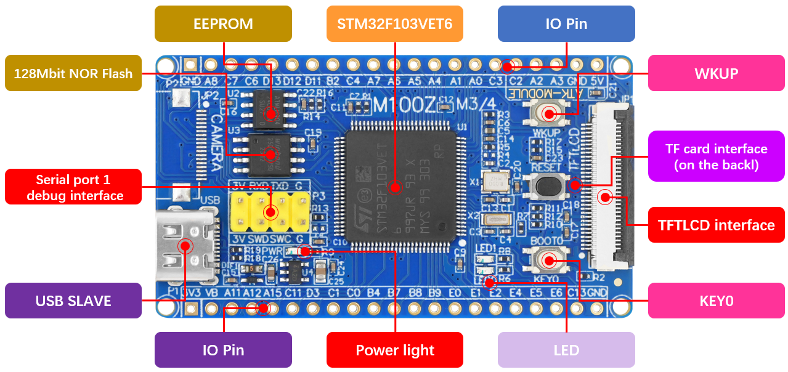
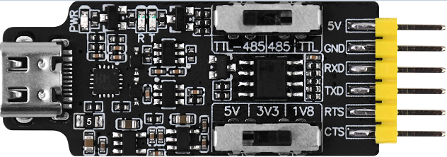
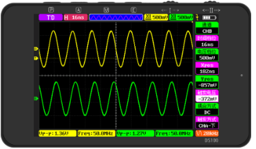

## 1 Repository overview

This repository is structured as follows:

+ A [1_docs](./1_docs) folder, containing related documentation, includes schematic diagrams, data sheets, pictures of each example configuration, pin elicitation diagrams, and pin assignment tables.
+ A [2_tools](./2_tools) folder, containing Development tools. Such as Flash download software, USB virtual serial port driver, and serial port terminal, etc
+ An [example](./examples) folder, containing examples of different peripherals.
+ A [libraries](./libraries) folder, containing HAL library for STM32F1.

## 2 Board Resources

Here aims to introduce the **hardware and software resources** of the M100Z-M3 Mini Board, including the introduction of chip resources, the introduction of experimental platform hardware resources, and the supporting resource use guide. By studying this manual, the reader will have a comprehensive understanding of the resources of the Mini Board, which will be very helpful for subsequent program design.

It is intended to provide readers with a comprehensive introduction to the M100Z-M3 Mini Board resources. It is highly recommended that you read this manual before learning the examples!

### 2.1 Hardware Description

M100Z-M3 Mini Board selects **STM32F103VET6** as MCU, the chip integrates 64KB SRAM, 512KB FLASH, 6 16-bit timers, 2 32-bit timers, 2 DMA controllers (total of 12 channels), 3 SPI interfaces, 2 full-duplex I2S interfaces, 2 I2C interfaces, 5 UARTs, 1 USB, 1 CAN, 3 12-bit ADCs, 2 12-bit DACs, 1 RTC, 1 SDIO, 1 FSMC, and 80 general-purpose I/O ports.

+ **EEPROM**:The EEPROM chip, with a capacity of 2Kb, which is equivalent to 256 bytes. It is used to store important data that cannot be lost during power loss, such as system settings parameters/touch screen calibration data, etc. With this, it is convenient to achieve non-volatile data storage.
+ **NOR FLASH**:The SPI FLASH chip expanded externally on the mini board, with a capacity of 128Mbit, which is equivalent to 16M bytes. It can be used to store user data, meeting the demand for large-capacity data storage. Of course, if you find that 16M bytes are not sufficient, you can store the data on an external TF card.
+ **USB slave**: this interface can not only be used as a USB slave communication interface, but also has a power supply function, which can supply power for the Mini Board. USB_Slave can be used to connect the computer to realize the USB virtual serial port experiment.
+ **Reset button**: used to reset the Mini Board.
+ **TF card interface**:The TF card interface driven via SDIO. The TF card capacity selection range is very wide (up to TB level). With this interface, it can meet the demand for massive data storage.
+ **TFTLCD interface**:This is the onboard LCD module interface on the mini board, which is connected to the TFTLCD module via FPC ribbon cable and an adapter board. This interface is compatible with the entire series of TFTLCD modules from Elecrow, including 2.4-inch, 3.5-inch, 4.3-inch, and 7-inch TFTLCD modules, and supports both resistive and capacitive touch functionalities.

+ **Serial port 1 debug interface**: used for simulation debugging, downloading code, etc.

### 2.2 Software Resources

There are up to **47** examples provided. Before learning each example, carefully read the **README.md**, which includes a brief introduction to the example function, hardware hookup, STM32CubeIDE configuration instructions, and running phenomena. Here are all the examples.

| Example Name                      | Example Name                      | Example Name                      |  
| --------------------------------- |  ----------------------           |  ----------------------           |
| 00_f103                           | 10_tftlcd                         | 19_spi                            |
| 01_led                            | 11_usmart                         | 20_touch                          | 
| 02_key                            | 12_rtc                            | 21_flash_eeprom                   |
| 03_exti                           | 13_1_lowpower_pvd                 | 22_malloc                         |  
| 04_uart                           | 13_2_lowpower_sleep               | 23_sd                             |
| 05_iwdg                           | 13_3_lowpower_stop                | 24_fatfs                          |
| 06_wwdg                           | 13_4_lowpower_standby             | 25_pictures                       | 
| 07_btim                           | 14_dma                            | 26_1_dsp_basicmath                | 
| 08_1_gtim_interrupt               | 15_1_adc_single_channel           | 26_2_dsp_fft                      |
| 08_2_gtim_pwm                     | 15_2_adc_dma_single_channel       | 27_atkncr                         |
| 08_3_gtim_capture                 | 15_3_adc_dma_multi_channel        | 28_iap                            |
| 08_4_gtim_count                   | 16_adc_temperature                | 28_touch_flash_app                |
| 09_1_atim_npwm                    | 17_1_dac_output                   | 29_usb_card_reader                |
| 09_2_atim_compare                 | 17_2_dac_triangular_wave          | 30_usb_vsp                        |
| 09_3_atim_cplm_pwm                | 17_3_dac_sine_wave                | 31_freertos_demo                  | 
| 09_4_atim_pwm_in                  | 18_iic                            |                                   |

## 3 How to use STM32CubeIDE
If you have not set up **STM32CubeIDE** or can't use it, you will need to do so following the [steps outlined in this tutorial](./1_docs/STM32CubeIDE_Usage_Guide.md).

## 4 Accessories
When using the MIni Board, you can use the following accessories.
 
| LCD module         | Dap Debugger   | USB to Serial Port module  | Digital Oscilloscope
| ------------------ | ----------------|---------------------------------------|------------------------------------------------ |
|      |         |      |  

