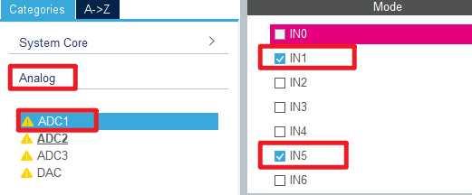
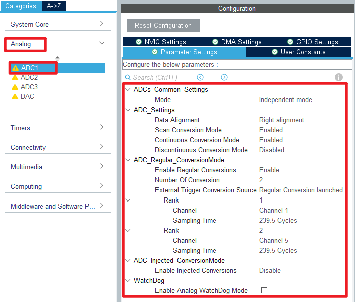
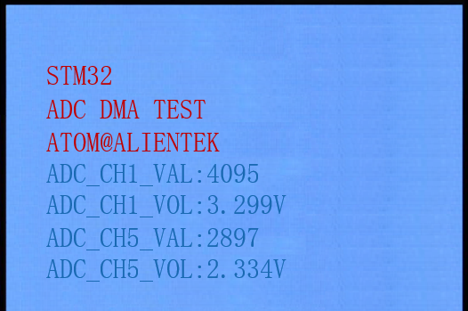

## ADC_DMA_Multi_Channel example<a name="brief"></a>

### 1 Brief
The function of this code is to collect the voltage on channel 1 and channel 5 of ADC through DMA, and display the digital amount of the voltage converted by ADC and the analog amount converted by ADC on the LCD module screen.
### 2 Hardware Hookup
The hardware resources used in this example are:
+ LED0 - PE5
+ USART1 - PA9/PA10
+ ADC1 - Channel1(PA1)
+ ADC1 - Channel5(PA5)
+ ALIENTEK  2.8/3.5/4.3/7 inch TFTLCD module

The ADC used in this example is an on-chip resource of STM32F103, so there is no corresponding connection schematic.

### 3 STM32CubeIDE Configuration

We copy the previous chapter project and name both the project and the.ioc file **15_3_adc_dma_multi_channel**.Next we start the ADC configuration by double-clicking the **15_3_adc_dma_multi_channel.ioc** file.

Since this example uses one more ADC channel than the example in the previous chapter, the ADC channel needs to be reconfigured.
Click **Analog > ADC1** to set. 



Next are the ADC1 parameters, as shown in the following screenshot.



Click **File > Save**, and you will be asked to generate code.Click **Yes**.

The code for the ADC and DMA is the same as in the previous chapter, but we have already covered them and will not repeat them here.

##### code
###### main.c
Here's the code in the main function.
```c#
/* USER CODE BEGIN PV */
#define ADC_DMA_BUF_SIZE      2 * 50             /* ADC DMA buffer size */
static uint16_t g_adc_dma_buf[ADC_DMA_BUF_SIZE]; /* ADC DMA buffer */

extern uint8_t g_adc_dma_sta; /* DMA transfer completion flag */
/* USER CODE END PV */
int main(void)
{
  /* USER CODE BEGIN 1 */
  uint8_t j;
  uint16_t i;
  uint32_t sum;
  uint16_t adcdata;
  float temp;
  /* USER CODE END 1 */

  /* MCU Configuration--------------------------------------------------------*/

  /* Reset of all peripherals, Initializes the Flash interface and the Systick. */
  HAL_Init();

  /* USER CODE BEGIN Init */

  /* USER CODE END Init */

  /* Configure the system clock */
  SystemClock_Config();

  /* USER CODE BEGIN SysInit */

  /* USER CODE END SysInit */

  /* Initialize all configured peripherals */
  MX_GPIO_Init();
  MX_DMA_Init();
  MX_USART1_UART_Init();
  MX_FSMC_Init();
  MX_ADC1_Init();
  /* USER CODE BEGIN 2 */
  lcd_init();                                     /* Initialize LCD */
  stm32f103ve_show_mesg();
  HAL_DMA_Start_IT(&hdma_adc1, (uint32_t)&ADC1->DR, (uint32_t)&g_adc_dma_buf, 0);
  HAL_ADC_Start_DMA(&hadc1, (uint32_t *)g_adc_dma_buf, ADC_DMA_BUF_SIZE);

  lcd_show_string(30, 50, 200, 16, 16, "STM32", RED);
  lcd_show_string(30, 70, 200, 16, 16, "ADC DMA TEST", RED);
  lcd_show_string(30, 90, 200, 16, 16, "ATOM@ALIENTEK", RED);

  lcd_show_string(30, 110, 200, 16, 16, "ADC1_CH1_VAL:0", BLUE);
  lcd_show_string(30, 130, 200, 16, 16, "ADC1_CH1_VOL:0.000V", BLUE);

  lcd_show_string(30, 150, 200, 16, 16, "ADC1_CH5_VAL:0", BLUE);
  lcd_show_string(30, 170, 200, 16, 16, "ADC1_CH5_VOL:0.000V", BLUE);

  adc_dma_enable(ADC_DMA_BUF_SIZE);   /* Start the ADC DMA acquisition */
  /* USER CODE END 2 */

  /* Infinite loop */
  /* USER CODE BEGIN WHILE */
  while (1)
  {
    if (g_adc_dma_sta == 1)
    {
      for (j = 0; j < 2; j++)
      {
        /* The average value of the ADC data acquired by DMA is calculated */
	  		sum = 0;

        for (i = 0; i < (ADC_DMA_BUF_SIZE / 2); i++) /* The multiple sampled values of the ADC are mean-filtered */
        {
          sum += g_adc_dma_buf[(2 * i) + j];
        }

        adcdata = sum / (ADC_DMA_BUF_SIZE / 2);     /* averaging */

        /* displaying results */
        lcd_show_xnum(134, 110 + (j * 40), adcdata, 4, 16, 0, BLUE);

        temp = (float)adcdata * (3.3 / 4096 ) ;    /* Calculate the actual voltage value (1000 times larger) */
        adcdata = temp;
        lcd_show_xnum(134, 130 + (j * 40), adcdata, 1, 16, 0, BLUE);

        temp -= adcdata;
        temp *= 1000;
        lcd_show_xnum(150, 130 + (j * 40), temp, 3, 16, 0X80, BLUE);

        g_adc_dma_sta = 0;                         /* Clear the DMA acquisition completion status flag */
        adc_dma_enable(ADC_DMA_BUF_SIZE);
      }
    }

    LED0_TOGGLE();             /* flashing LED0 indicates that the system is running */
    HAL_Delay(500);            /* delay 500ms */

    /* USER CODE END WHILE */

    /* USER CODE BEGIN 3 */
  }
  /* USER CODE END 3 */
}
```
The code in this section is very similar to that in the previous chapter.The data for DMA transfers are stored in the **g_adc_dma_buf** array-two channels are used in this case, so a larger DMA transfer destination memory is required. Each channel uses 50 uint16_t of space for the ADC data. To reduce error, we take the average of the data in the array.


### 4 Running
#### 4.1 Compile & Download
After the compilation is complete, connect the DAP and the Mini Board, and then connect to the computer together to download the program to the Mini Board.
#### 4.2 Phenomenon
Press the **RESET** button to begin running the program on your Mini Board, observe the LED0 flashing on the Mini Board, open the serial port and the host computer ATK-XCOM can see the prompt information of the example, indicating that the code download is successful. When the dupont line is used to connect the **PA1** and **PA5** pins with different voltage values, the digital and analog voltage of the LCD screen will also change. **It should be noted that the input voltage cannot exceed the 3.3V threshold of the Mini Board**, otherwise it may damage the Mini Board. The phenomenon is illustrated in the following figure:



[jump to title](#brief)